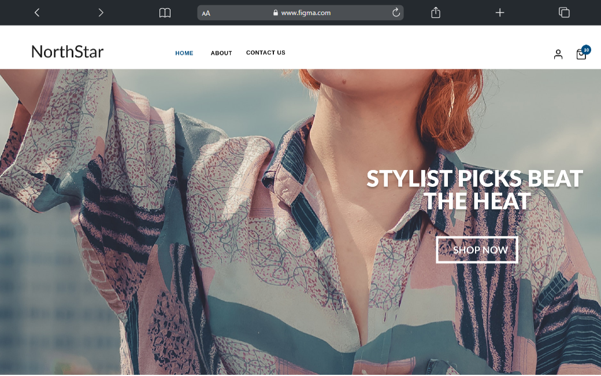

# Developia's Fashion E-commerce Website


## Project Description


## Figma design
[eCommerce Fashion website](https://www.figma.com/design/hYEzl4NjhXLYEQAQ80ylZa/eCommerce-Fashion-Website-(Community))

Developia Fashion is an E-commerce Clothing Website targeting WhatsApp Vendors. 

## Folder Structure

The folder structure of the project is as follows:

```
Developia_fashion/
│
├── node_module/            
├── public/            
├── src/            
│   ├── assets/        
│   └── components/            
│   └── contexts/           
│   └── pages/        
│   └── utils/     
│
└── .eslintrc.cjs
└── .gitignore
└── index.html
└── package-lock.json
└── package.json
└── README.md
└── vite.config.js
```

## Getting Started

Follow these steps to get the project up and running on your local machine.

### Clone the Repository

```bash
git clone https://github.com/Blard-omu/Developia-Frontend-Team.git
```

### Install Dependencies

```bash
# Install frontend dependencies
cd Developia-Frontend-Team
npm install


### Run the Development Servers

```bash
# Start the frontend development server
npm run dev

```

Now you can access the application at `http://localhost:5173`.

## Contributing

Follow these guidelines to contribute to the project:

1. Clone the repository to your local machine.
2. Create a new branch for your feature or bug fix.
3. Make your changes and commit them with descriptive commit messages.
4. Push your changes to your branch on your clone repository.
5. Submit a pull request to the "dev" branch.

### Branch Naming Convention

When naming your branch, follow this convention:

- `feature/<feature-name>` for new features e.g blard/navbar
- `bugfix/<bug-description>` for bug fixes e.g kiki/navbaroverflow

### Avoiding Conflicts

To avoid conflicts when pushing changes to your branch, make sure to pull any changes from the remote repository's `dev` branch into your local branch before pushing:

```bash
git pull origin dev
```

NB: Resolve any conflicts locally and then push your changes.

## Code Style

Follow the existing code style and conventions in the project. Use meaningful variable and function names, and ensure your code is properly formatted.

## Issues and Feedback

If you encounter any issues or have feedback, please [open an issue](<issue-tracker-url>) on the GitHub repository, or reach out to BLARD or any of the team members.

---

